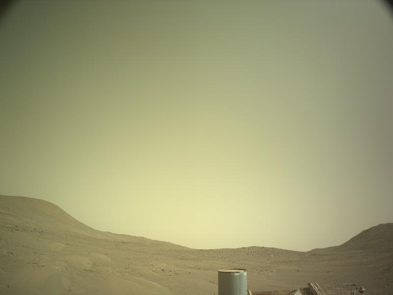

# Learning HTML and CSS
 
<h1>I code, therefore, I am.</h1>
<h2>Vicky Wong</h2>
 
<h1>Humans have reached Mars</h1>
<h3>The Starship rocket successfully landed on the red planet this morning.</h3>

After a 115 days long journey, the crew of 12 finally arrived at their destination. This is the first time humans have set foot on a planet other than Earth.

 

